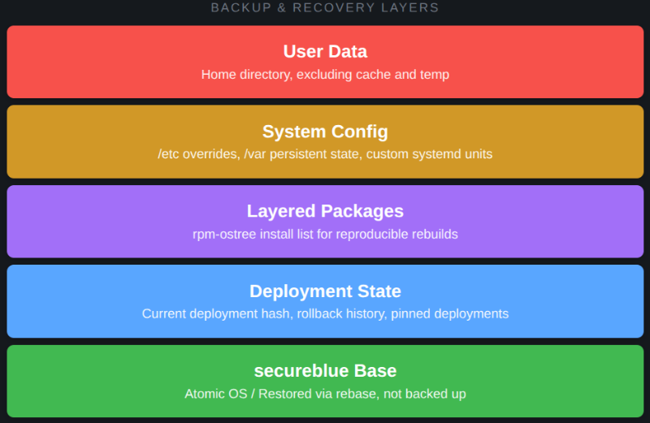

# secureblue-backup

Backup and disaster recovery for secureblue OS.

https://secureblue.dev/

This repository provides instructions to implement a complete backup strategy for secureblue's atomic architecture: user data preservation, system configuration capture, layered package reproducibility, deployment state tracking, and base image restoration.

**View the full guide here:** [secureblue-backup](https://x144k.github.io/secureblue-backup)

## My setup

I built this on my daily driver running secureblue on a Lenovo Legion 7 Pro (16IRX8H). Clean install with borgbackup, fastfetch, ivpn, and keepassxc layered for daily use.

- **OS:** secureblue (Fedora Silverblue/Kinoite base)
- **Hardware:** Intel i9-13900HX; NVIDIA GeForce RTX 4090
- **Install type:** Clean install / Rebase from Fedora 44

## Why this exists

rpm-ostree systems fragment state across multiple layers. The base image is one thing, /etc overrides are another, /var holds persistent service data, and layered packages live outside the base image entirely. A full-disk clone captures all of this, but it also captures the base image unnecessarily, wasting space and complicating restoration. And a file-level backup restricted to /home misses /etc and /var entirely.

This guide documents the specific split: what to preserve, what to ignore, and how to reconstruct a working system from those pieces. It's not about finding a new backup tool; it's about applying existing tools correctly to an atomic filesystem layout.

## What traditional approaches miss

This is what standard backup strategies get wrong on rpm-ostree. Your mileage may vary.

- **Rsync or Borg to /usr:** The base image in /usr is already reproducible via `rpm-ostree rebase`. Backing it up duplicates gigabytes of data that can be fetched from the upstream repository. The meaningful state lives in the overlays, not the base.
- **File-level backup of /etc without metadata:** rpm-ostree tracks /etc as a three-way merge between the base image, previous deployment, and current changes. Restoring plain files without understanding this merge model creates unmanaged drift that survives across rebases.
- **Ignoring /var:** Service state, container storage, and cached data live in /var. A home-directory-only backup loses this entirely. Some of it should be preserved; some is ephemeral and should be excluded by design.
- **Forgetting layered packages:** `rpm-ostree install` places packages in a separate layer. Rebuilding from a fresh rebase without recording these packages leaves you with a broken environment. The package list is part of the system state.

## Components

- **User Data:** Selective home directory backup, excluding cache, temp, and Flatpak runtime data
- **System Config:** Capture of /etc overrides, /var persistent state, and custom systemd units
- **Layered Packages:** Reproducible package list export for rpm-ostree rebuilds
- **Deployment State:** Deployment hash, rollback history, and pinned deployment tracking
- **Verification:** Automated restore testing and integrity checks

## Status

Functional on clean secureblue installs. See the guide for implementation.
